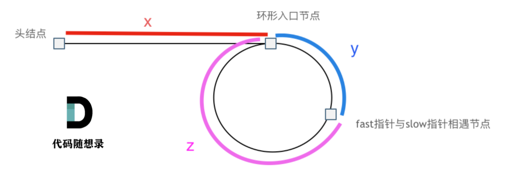

# 链表

# 203.移除链表元素

```cpp
class Solution {
public:
    ListNode* removeElements(ListNode* head, int val) {
        //初始化一个虚拟头节点
        ListNode *beg = new ListNode(-1, head);
        for(ListNode *cur = beg; cur->next != nullptr;){
            if(cur->next->val == val){
                ListNode *tmp = cur->next;
                cur->next = tmp->next;
                delete tmp; 
            }else{
                cur = cur->next;
            }
        }
        head = beg->next;
        delete beg;
        return head;
    }
};
```

经典的学习数据结构的时候，对链表进行增加的题目。

思路是简单的，但是在实现过程中，我们每次操作的是cur的下一个节点，**所以我们当我们进行一次删除的时候，cur的next已经变化了，就不需要在 cur = cur->next。只有没有被删除的时候，才调用 cur = cur->next。**
# 707.设计链表

大一的时候数据结构的题目。

设计自己的链表。

多看几遍就会了，很基础，很经典。

# 206.翻转链表

```cpp
class Solution {
public:
//迭代法
    ListNode* reverseList(ListNode* head) {
        ListNode* tmp;
        ListNode* cur = head;
        ListNode* pre = nullptr;
        while(cur != nullptr){
            tmp = cur->next;
            cur->next = pre;
            pre = cur;
            cur = tmp;
        }
        return pre;
    }
//递归法
    ListNode* reverse(ListNode* pre, ListNode* cur){
        if(cur == nullptr){
            return pre;
        }
        ListNode* tmp = cur->next;
        cur->next = pre;
        return reverse(cur, tmp);
    }
    ListNode* reverseList(ListNode* head) {
        return reverse(nullptr, head);
    }
};
```

这道题有两种方法，迭代法和递归法。

理论上来说，都是差不多的。

迭代法更直观，递归法简洁但是不太容易理解。

这个题应该也是熟悉了就很简单的类型～

多看多复习。

# 24.两两交换链表中的节点

```cpp
class Solution {
public:
    ListNode* swapPairs(ListNode* head) {
        //虚拟头节点
        ListNode* dummy_head = new ListNode(-1, head);
        ListNode* cur = dummy_head;
        //注意循环终止的条件,奇数和偶数
        while(cur->next != nullptr && cur->next->next != nullptr){
            ListNode* tmp1 = cur->next;
            ListNode* tmp2 = tmp1->next->next;
            cur->next = cur->next->next;
            cur->next->next = tmp1;
            cur->next->next->next = tmp2;
            cur = cur->next->next;
        }
        return dummy_head->next;
    }
};
```

如果理解清楚了，这道题是十分简单的。

画图理清思路。

重点是每一步如何交换，交换的顺序，以及要暂时存储的位置。

以及要考虑终止的情况，就是奇数为cur->next != nullptr和cur->next->next != nullptr。

# 19.**删除链表的倒数第N个节点**

```cpp
class Solution {
public:
    //双指针
    ListNode* removeNthFromEnd(ListNode* head, int n) {
        ListNode* dummy_head = new ListNode(-1, head);
        ListNode* fast = dummy_head;
        ListNode* slow = dummy_head;
        for(int i = 0; i < n+1; i++){
            fast = fast->next;
        }
        while(fast != nullptr){
            fast = fast->next;
            slow = slow->next;
        }
        ListNode* tmp = slow->next;
        slow->next = tmp->next;
        delete tmp;
        tmp = nullptr;
        return dummy_head->next;
    }
    //遍历一遍,先得到长度，再直接定位删除
    int getlength(ListNode* head){
        ListNode* cur = head;
        int length = 0;
        while(cur != nullptr){
            ++length;
            cur = cur->next;
        }
        return length;
    }
    ListNode* removeNthFromEnd(ListNode* head, int n) {
        ListNode* dummy_head = new ListNode(-1, head);
        ListNode* cur = dummy_head;
        int length = getlength(head);
        for(int i = 0; i < length - n; ++i){
            cur = cur->next;
        }
        ListNode* tmp = cur->next;
        cur->next = tmp->next;
        delete tmp;
        tmp = nullptr;
        return dummy_head->next;
    }
};
```

题解给出了两种方法：

- 第一种为双指针法，fast先往前移动n + 1位，这样就保证了，fast和slow始终间隔n+1，这样当fast和slow同时移动，fast到末尾以后，slow刚好指向要删除节点的前一个节点，这样刚好能删除。时间复杂度也为O(L)
- 第二种则是暴力得到长度的方法，我先遍历一边链表得到链表的长度，这样就可以直接移动固定距离到要删除节点的前面了。时间复杂度也为O(L)

这样来看两种方法的时间复杂度实际上是差不多的。

只是双指针方法更巧妙一点，暴力方法直观。

# 0207.链表相交

```cpp
class Solution {
public:
//极度巧妙方法
    ListNode *getIntersectionNode(ListNode *headA, ListNode *headB) {
        ListNode *A = headA, *B = headB;
        while(A != B){
            A = A != nullptr ? A->next : headB;
            B = B != nullptr ? B->next : headA;
        }
        return A;
    }
//先获取长度，再直接比较
    ListNode *compare(ListNode *currA, ListNode *currB, int lenA, int lenB){
        // 求长度差
        int gap = lenA - lenB;
         // 让curA【较长的链表】和curB在同一起点上，即让curA先走gap步
        for(; gap > 0; --gap){
            currA = currA->next;
        }
         // 遍历curA 和 curB，遇到相同则直接返回，相交的则为相交节点，后面全部一样
        while(currA != nullptr){
            if(currA == currB){
                return currA;
            }
            currA = currA->next;
            currB = currB->next;
        }
        return nullptr;
    }

    ListNode *getIntersectionNode(ListNode *headA, ListNode *headB) {
        ListNode *currA = headA, *currB = headB;
        int lenA = 0, lenB = 0;
         // 求链表A的长度
        while(currA != nullptr){
            ++lenA;
            currA = currA->next;
        }
        // 求链表B的长度
        while(currB != nullptr){
            ++lenB;
            currB = currB->next;
        }
        currA = headA;
        currB = headB;
        if(lenA > lenB){
            return compare(currA, currB, lenA, lenB);
        }else{
            return compare(currB, currA, lenB, lenA);
        }
    }
};
```

- 第一种极度巧妙的方法我是想不到的，虽然代码十分简洁，但是可能一时半会儿真想不出来，具体解释详见https://leetcode.cn/problems/intersection-of-two-linked-lists-lcci/solutions/1190240/mian-shi-ti-0207-lian-biao-xiang-jiao-sh-b8hn
- 第二种其实和第一种的时间复杂度一样，都是O(m+n)，空间复杂度为O(1)。但是更好理解，就是先求出两个链表的长度差，然后把长的链表指针cur向后移动lenA-lenB步数，这样就可以开始比较了。**如果两个链表相交，则它们相交后的都指向同一串链表~**


# **142.环形链表II**

```cpp
class Solution {
public:
    ListNode *detectCycle(ListNode *head) {
        //快慢指针
        ListNode* fast = head;
        ListNode* slow = head;
        //
        while(fast != nullptr && fast->next != nullptr){
            fast = fast->next->next;
            slow = slow->next;
            if(fast == slow){//判断是否有环
                ListNode* index1 = head;
                ListNode* index2 = fast;
                while(index1 != index2){ //判断环的入口
                    index1 = index1->next;
                    index2 = index2->next;
                }
                return index1;
            }
        }
        return nullptr;t
    }
};

```

就是要求找到一个链表的环，并给出环的入口。就是两点，确认是否有环和环的入口。

因此，使用快慢指针进行追及问题的方法。

fast一次走两步，slow一次走一步，因此，当fast能够和slow相遇时，就一定有环，并且slow一圈环没走完就相遇了。

而对x于y进行公示代换的数学式子容易知道，图中，**x是等于z+n倍的圈数的**
