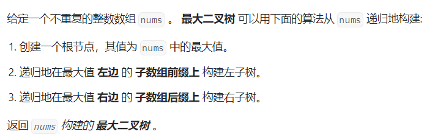

# 二叉树

# 1.二叉树前中后序的递归遍历

```cpp
//前序递归
class Solution {
public:
    void qian_xu(TreeNode* root, vector<int>& result){
        if(root == nullptr){
            return;
        }
        result.push_back(root->val);
        qian_xu(root->left, result);
        qian_xu(root->right, result);
    }
    vector<int> preorderTraversal(TreeNode* root) {
        vector<int> result;
        qian_xu(root, result);
        return result;
    }
};
//后序递归
class Solution {
public:
    void hou_xu(TreeNode* root, vector<int>& result){
        if(root == nullptr){
            return ;
        }
        hou_xu(root->left, result);
        hou_xu(root->right, result);
        result.push_back(root->val);
    }
    vector<int> postorderTraversal(TreeNode* root) {
        vector<int> result;
        hou_xu(root, result);
        return result;
    }   
};
//中序递归
class Solution {
public:
    void zhong_xu(TreeNode* root, vector<int>& result){
        if(root == nullptr){
            return ;
        }
        zhong_xu(root->left, result);
        result.push_back(root->val);
        zhong_xu(root->right, result);
    }
    vector<int> inorderTraversal(TreeNode* root) {
        vector<int> result;
        zhong_xu(root, result);
        return result;
    }
};
```

只要记住前中后序遍历的方式就行了（**这里前中后，其实指的就是中间节点的遍历顺序**）：

- 前序：中左右
- 中序：左中右
- 后序：左右中

# 2.二叉树的迭代遍历

## 前序和后序遍历

```cpp
//前序遍历
class Solution {
public:
    vector<int> preorderTraversal(TreeNode* root) {
        vector<int> result;
        stack<TreeNode*> stk;
        if(root == nullptr) return result;
        stk.push(root);
        while(!stk.empty()){
            TreeNode* node = stk.top();
            stk.pop();
            result.push_back(node->val);
            if(node->right != nullptr) stk.push(node->right);
            if(node->left != nullptr) stk.push(node->left);
        }
        return result;
    }
};
//后序遍历
class Solution {
public:
    vector<int> postorderTraversal(TreeNode* root) {
        vector<int> result;
        stack<TreeNode*> stk;
        if(root == nullptr) return result;
        TreeNode* cur = root;
        stk.push(cur);
        while(!stk.empty()){
            TreeNode* node = stk.top();
            stk.pop();
            result.push_back(node->val);
            if(node->left != nullptr) stk.push(node->left);
            if(node->right != nullptr) stk.push(node->right);
        }
        reverse(result.begin(), result.end());
        return result;
    }   
};
```

前序遍历和后序遍历的方法可以稍微调整一下互为镜像：

- 前序：中左右
- 后序：左右中

其中，前序的方法是，先把root压入栈，随后压右节点，再压左节点（左节点先出栈），还是十分容易理解的。

后序就是调整一下前序的顺序变为中右左，然后得到的result直接reverse一下就可以了，十分巧妙。

## 中序遍历

```cpp
class Solution {
public:

    vector<int> inorderTraversal(TreeNode* root) {
        vector<int> result;
        stack<TreeNode*> stk;
        TreeNode* cur = root;
        while(cur != nullptr || !stk.empty()){ //循环结束条件
            if(cur != nullptr){  // 指针来访问节点，访问到最底层
                stk.push(cur); // 将访问的节点放进栈
                cur = cur->left;  // 左 
            }else{
                cur = stk.top(); // 从栈里弹出的数据，就是要处理的数据（放进result数组里的数据）
                stk.pop();
                result.push_back(cur->val); // 中
                cur = cur->right; // 右
            }
        } 
        return result;
    }
};
```

中序遍历则稍微不同一点，需要先一步直达树的最左侧并将之前的全部压栈（这个过程就相当于把每个子树的“左”节点都入栈）。谈一个左节点，就把右节点入栈，并压他的左节点。

思考这个过程即可～

# 3.二叉树的层序遍历

```cpp
class Solution {
public:
    vector<vector<int>> levelOrder(TreeNode* root) {
        queue<TreeNode*> que;
        if (root != NULL) que.push(root);
        vector<vector<int>> result;
        while (!que.empty()) {
            int size = que.size();
            vector<int> vec;
            // 这里一定要使用固定大小size，不要使用que.size()，因为que.size是不断变化的
            for (int i = 0; i < size; i++) {
                TreeNode* node = que.front();
                que.pop();
                vec.push_back(node->val);
                if (node->left) que.push(node->left);
                if (node->right) que.push(node->right);
            }
            result.push_back(vec);
        }
        return result;
    }
};
```

二叉树的层序遍历还是比较简单的。写多了直接都背下来了。。。

一层一层的压入队列就好了。

背完就能打十个了!

- [**102.二叉树的层序遍历(opens new window)**](https://leetcode.cn/problems/binary-tree-level-order-traversal/)
- [**107.二叉树的层次遍历II(opens new window)**](https://leetcode.cn/problems/binary-tree-level-order-traversal-ii/)
- [**199.二叉树的右视图(opens new window)**](https://leetcode.cn/problems/binary-tree-right-side-view/)
- [**637.二叉树的层平均值(opens new window)**](https://leetcode.cn/problems/average-of-levels-in-binary-tree/)
- [**429.N叉树的层序遍历(opens new window)**](https://leetcode.cn/problems/n-ary-tree-level-order-traversal/)
- [**515.在每个树行中找最大值(opens new window)**](https://leetcode.cn/problems/find-largest-value-in-each-tree-row/)
- [**116.填充每个节点的下一个右侧节点指针(opens new window)**](https://leetcode.cn/problems/populating-next-right-pointers-in-each-node/)
- [**117.填充每个节点的下一个右侧节点指针II(opens new window)**](https://leetcode.cn/problems/populating-next-right-pointers-in-each-node-ii/)
- [**104.二叉树的最大深度(opens new window)**](https://leetcode.cn/problems/maximum-depth-of-binary-tree/)
- [**111.二叉树的最小深度**](https://leetcode.cn/problems/minimum-depth-of-binary-tree/)

# 4.反转二叉树

前序迭代法：

```cpp
class Solution {
public:
    TreeNode* invertTree(TreeNode* root) {
        if(root == nullptr) return root;
        swap(root->left, root->right); //中
	        invertTree(root->left);//左
        invertTree(root->right);//右
        return root;
    }
};
```

后序迭代法：

```cpp
class Solution {
public:
    TreeNode* invertTree(TreeNode* root) {
        if(root == nullptr) return root;
        invertTree(root->left);
        invertTree(root->right);
        swap(root->left, root->right);
        return root;
    }
};
```

中序迭代法：

```cpp
class Solution {
public:
    TreeNode* invertTree(TreeNode* root) {
        if(root == nullptr) return root;
        invertTree(root->left);
        swap(root->left, root->right);
        invertTree(root->left);
        return root;
    }
};
```

前序迭代法：

```cpp
class Solution {
public:
    TreeNode* invertTree(TreeNode* root) {
        stack<TreeNode*> stk;
        if(root == nullptr) return root;
        stk.push(root);
        while(!stk.empty()){
            TreeNode* cur = stk.top();
            stk.pop();
            swap(cur->left, cur->right);
            if(cur->right != nullptr) stk.push(cur->right);
            if(cur->left != nullptr) stk.push(cur->left);
        }
        return root;
    }
};
```

后序迭代法：

```cpp
class Solution {
public:
    TreeNode* invertTree(TreeNode* root) {
        stack<TreeNode*> stk;
        if(root == nullptr) return root;
        stk.push(root);
        while(!stk.empty()){
            TreeNode* cur = stk.top();
            stk.pop();
            if(cur->right) stk.push(cur->right);
            if(cur->left) stk.push(cur->left);
            swap(cur->left, cur->right);
        }
        return root;
    }
};
```

中序迭代法：

```cpp
class Solution {
public:
    TreeNode* invertTree(TreeNode* root) {
        stack<TreeNode*> stk;
        TreeNode* cur = root;
        while(cur != nullptr || !stk.empty()){
            if(cur != nullptr){
                stk.push(cur);
                cur = cur->left;
            }else{
                cur = stk.top();
                stk.pop();
                TreeNode* tmp =cur->right;
                swap(cur->left, cur->right);
                cur = tmp;
            }
        }
        return root;
    }
};
```

层序迭代法：简单

# 5.对称二叉树

```cpp
class Solution {
public:
    //递归法
    bool compare(TreeNode* left, TreeNode* right){
        if(left == nullptr && right == nullptr) return true;
        else if(left != nullptr && right == nullptr) return false;
        else if(left == nullptr && right != nullptr) return false;
        else if(left->val != right->val) return false;

        bool outside = compare(left->left, right->right);
        bool inside = compare(left->right, right->left);
        return outside && inside;
    }
    bool isSymmetric(TreeNode* root) {
        if(root == nullptr) return true;
        return compare(root->left, root->right);
    }
    //迭代法
    bool isSymmetric_2(TreeNode* root) {
        if(root == nullptr) return true;
        queue<TreeNode*> que;
        que.push(root->left);
        que.push(root->right);
        while(!que.empty()){
            TreeNode* curleft = que.front();
            que.pop();
            TreeNode* curright = que.front();
            que.pop();
            if(!curleft && !curright) continue;
            if(curleft == nullptr && curright != nullptr) return false;
            else if(curleft != nullptr && curright == nullptr) return false;
            else if(curleft->val != curright->val) return false;

            que.push(curleft->left);
            que.push(curright->right);

            que.push(curleft->right);
            que.push(curright->left);
        }
        return true;
    }
};

```

还是比较简单的。别管前序还是后序，想清楚每一次要对应比较的东西就可以了。

(这个题的思路还可以用来比较两个树是否相等。)

# 512.另一棵树的子树🌟🌟

第一种方法贼简单，对每一个节点的子树进行遍历判断是否相等。

```cpp
class Solution {
public:
    bool compare(TreeNode* left, TreeNode* right){
        if(left == nullptr && right == nullptr) return true;
        else if(left == nullptr && right != nullptr) return false;
        else if(left != nullptr && right == nullptr) return false;
        else if(left->val != right->val) return false;

        bool leftside = compare(left->left, right->left);
        bool rightside = compare(left->right, right->right);
        return leftside && rightside;
    }
    bool isSubtree(TreeNode* root, TreeNode* subRoot) {
        stack<TreeNode*> stk;
        if(root == nullptr && subRoot == nullptr) return true;
        stk.push(root);
        while(!stk.empty()){
            TreeNode* cur = stk.top();
            stk.pop();
            if(compare(cur, subRoot)) return true;
            if(cur->right) stk.push(cur->right);
            if(cur->left) stk.push(cur->left);
        }
        return false;
    }
};
```

第二种方法则是先先序遍历两个数得到两个序列（对叶子节点进行填充，防止出粗），然乎比较是否是子序列。【先序遍历】🌟🌟🌟🌟

比较子序列用kmp算法~

```cpp
class Solution {
public:
    void getOrder(TreeNode* root, vector<int>& order){
        if(root == nullptr) return ;

        order.push_back(root->val);

        if(root->left) getOrder(root->left, order);
        else order.push_back(INT_MIN);

        if(root->right) getOrder(root->right, order);
        else order.push_back(INT_MAX);
    }

    bool kmp(const vector<int>& sorder, const vector<int>& rorder){
        vector<int> next(rorder.size(), 0);
        //构造next
        next[0] = 0;
        for(int i = 1; i < rorder.size(); ++i){
            int j = next[i - 1];
            //找到当前之前的最长公共字串
            while(j > 0 && rorder[i] != rorder[j]){
                j = next[j - 1];
            }
            if(rorder[i] == rorder[j]){
                next[i] = j + 1;
            }else{
                next[i] = 0;
            }
        }
        int left, right;
        for(left = 0; left < sorder.size(); ++left){
            while(right > 0 && sorder[left] != rorder[right]){
                right = next[right - 1];
            }
            if(sorder[left] == rorder[right]) ++right;
            if(right == rorder.size()) return true;
        }
        return false;
    }

    bool isSubtree(TreeNode* root, TreeNode* subRoot) {
        vector<int> sorder, rorder;
        getOrder(root, sorder);
        getOrder(subRoot, rorder);
        for(auto i : sorder) cout << i <<" ";
        cout << endl;
        for(auto i : rorder) cout << i <<" ";
        cout << endl;
        return kmp(sorder, rorder);
    }
};
```

第三种方法，进行树的哈希运算。十分考验人啊，面试的时候估计G了🌟🌟🌟

```
class Solution {
public:
    static constexpr int MAX_N = 2000;
    static constexpr int MAX_VAL = 10000;
    vector<int> prime;
    bool falg = false;
    int subRoot_hash;
    void get_prime(vector<int>& prime){
        vector<bool> all(MAX_N + 1, true);
        all[0] = all[1] = false;
        for(int i = 2; i <= MAX_N; ++i){
            if(all[i]){
                for(int j = 2 * i; j <= MAX_N; j += i){
                    all[j] = false;
                }
                prime.push_back(i);
            }
        }
    }
    int dfs(TreeNode* root){
        if(root == nullptr) return 814;
        int left = dfs(root->left);
        int right = dfs(root->right); 
        int left_prime = root->left ? ((root->left->val) / MAX_VAL * prime.size()) : 0;
        int right_prime = root->right ? ((root->right->val) / MAX_VAL * prime.size()) : 0;
        int x = root->val 
                + (31 * left * prime[left_prime]) % MAX_VAL
                + (179 * right * prime[right_prime] % MAX_VAL);
        if(x == subRoot_hash) falg = true;    
        cout << x <<endl;
        return x;
    }

    bool isSubtree(TreeNode* root, TreeNode* subRoot) {
        get_prime(prime);
        subRoot_hash = dfs(subRoot);
        cout << "target:" << subRoot_hash <<endl;
        falg = false;
        dfs(root);
        return falg;

    }
};
```

# 222.**完全二叉树的节点个数**

方法一：当成普通的二叉树进行后序遍历获得数量:

```cpp
class Solution {
public:
    int getNum(TreeNode* node){
        if(node == nullptr) return 0;
        int left_num = getNum(node->left);
        int right_num = getNum(node->right);
        return left_num + right_num + 1;
    }
    int countNodes(TreeNode* root) {
        return getNum(root);
    }
};
```

方法二：利用完全二叉树（**在完全二叉树中，除了最底层节点可能没填满外，其余每层节点数都达到最大值，并且最下面一层的节点都集中在该层最左边的若干位置。若最底层为第 h 层，则该层包含 1~ 2^(h-1)  个节点。**）定义：

所以可以判断子树是否为满二叉树，减少递归时间。

```cpp
class Solution {
public:

    int countNodes(TreeNode* root) {
        if(root == nullptr) return 0;
        TreeNode* left = root->left;
        TreeNode* right = root->right;
        int leftDepth = 0, rightDepth = 0;
        while(left){
            left = left->left;
            ++leftDepth;
        }
        while(right){
            right = right->right;
            ++rightDepth;
        }
        if(leftDepth == rightDepth){
            return (2 << leftDepth) - 1; 
        }
        return countNodes(root->left) + countNodes(root->right) + 1;
    }
};
```

# **110.平衡二叉树**

```cpp
class Solution {
public:
    int getHeight(TreeNode* root){
        if(root == nullptr) return 0;
        int leftHeight = getHeight(root->left);
        if(leftHeight == -1) return -1;
        int rightHeight = getHeight(root->right);
        if(rightHeight == -1) return -1;
        return abs(leftHeight - rightHeight) > 1 ? -1 : max(leftHeight,rightHeight) + 1;

    }
    bool isBalanced(TreeNode* root) {
        return getHeight(root) == -1 ? false : true;
    }
};
```

平衡二叉树判断，简单清晰。

# 404.左叶子之和

深度优先（前序）：

```cpp
class Solution {
public:
    int dfs(TreeNode* root){
        if(root == nullptr) return 0; //当前节点为空，左节点为0
        if(root->left == nullptr && root->right == nullptr) return 0;//当前节点为叶子节点，左节点为0
        int left_value = dfs(root->left);
        int right_value = dfs(root->right);
        if(root->left && root->left->right == nullptr && root->left->left == nullptr){
            left_value += root->left->val;
        }
        return left_value + right_value;
    }
    int sumOfLeftLeaves(TreeNode* root) {
        return dfs(root);
    }
};
```

# **106.从中序与后序遍历序列构造二叉树**

```cpp
class Solution {
public:
    TreeNode* buildTree(vector<int>& inorder, vector<int>& postorder) {
        if(postorder.size() == 0) return nullptr; //第一步：如果数组大小为零的话，说明是空节点了。+

        int rootValue = postorder[postorder.size() - 1]; //第二步：如果不为空，那么取后序数组最后一个元素作为节点元素。
        TreeNode* root = new TreeNode(rootValue);   //创建根节点
        if(postorder.size() == 1) return root;

        int split_index;
        for(split_index = 0; split_index < inorder.size(); ++split_index){
            if(inorder[split_index] == rootValue) break;
        } //第三步：找到后序数组最后一个元素在中序数组的位置，作为切割点

        //第四步：切割中序数组，切成中序左数组和中序右数组 （顺序别搞反了，一定是先切中序数组）
        vector<int> left_inorder(inorder.begin(), inorder.begin() + split_index);
        vector<int> right_inorder(inorder.begin() + split_index + 1, inorder.end());

        //第五步：切割后序数组，切成后序左数组和后序右数组

        vector<int> left_postorder(postorder.begin(), postorder.begin() + left_inorder.size());
        vector<int> right_postorder(postorder.begin() + left_inorder.size(), postorder.end() - 1);

        //第六步：递归处理左区间和右区间
        root->left = buildTree(left_inorder, left_postorder);
        root->right = buildTree(right_inorder, right_postorder);

        return root;
    }
};
```

思路十分清晰，剩下的就是完全写出来，按照这几个步骤基本没问题：

- 第一步：如果数组大小为零的话，说明是空节点了。
- 第二步：如果不为空，那么取后序数组最后一个元素作为节点元素。
- 第三步：找到后序数组最后一个元素在中序数组的位置，作为切割点
- 第四步：切割中序数组，切成中序左数组和中序右数组 （顺序别搞反了，一定是先切中序数组）
- 第五步：切割后序数组，切成后序左数组和后序右数组
- 第六步：递归处理左区间和右区间

# 654.最大二叉树

```cpp
class Solution {
public:
    TreeNode* construct(vector<int>& nums, vector<int>::iterator begin, vector<int>::iterator end){
        if(begin == end) return nullptr; //为空返回空指针

        vector<int>::iterator max_index = begin;
        for(auto i = begin; i != end; ++i){
            if(*i > *max_index) max_index = i;
        } //找到最大的迭代器

        TreeNode* root = new TreeNode(*max_index);

        root->left = construct(nums, begin, max_index);
        root->right = construct(nums, max_index + 1, end);

        return root;

    }
    TreeNode* constructMaximumBinaryTree(vector<int>& nums) {
        return construct(nums, nums.begin(), nums.end());
    }
};
```



题目已经告诉怎么做了笑死

# 98.验证二叉搜索树

这种相当于中序遍历树，得到的是一个递增数列，然后判断这个数列是否是递增的即可。

```cpp
class Solution {
public:
    void bfs(TreeNode* cur, vector<int>& result){
        if(cur == nullptr) return;
        bfs(cur->left, result);
        result.push_back(cur->val);
        bfs(cur->right, result);
        return;
    }
    bool isValidBST(TreeNode* root) {
        vector<int> result;
        bfs(root, result);
        auto min = *(result.begin());
        for(int i = 1; i < result.size(); ++i){
            if(result[i] <= min) return false;
            min = result[i];
        }
        return true;
    }
};
```

这种是双指针法，简单，但是需要理解，fast为每次的下一个指针，前后比较即可。

```cpp
class Solution {
public:
    TreeNode* fast = nullptr;
    bool isValidBST(TreeNode* root) {
        if(root == nullptr) return true;

        bool left = isValidBST(root->left);

        if(fast != nullptr && fast->val >= root->val) return false;
        fast = root;

        bool right = isValidBST(root->right);
        return left && right;
        
    }
};
```

# 530.二叉搜索树的最小绝对差

```cpp
class Solution {
public: 
    int result = INT_MAX;
    TreeNode* fast = nullptr;
    void retravsal(TreeNode* cur){
        if(cur == nullptr) return;
        retravsal(cur->left);

        if(fast != nullptr){
            result = result > (cur->val - fast->val) ? (cur->val - fast->val) : result;
        }
        fast = cur;
        retravsal(cur->right);
    }
    int getMinimumDifference(TreeNode* root) {
        retravsal(root);
        return result;
    }
};
```

虽然题目比较的是任意节点之间的差，但是因为二叉搜索树是有序的，所以相当于是相邻节点的最小差值。

用双指针迭代即可。

# 501.二叉搜索树中的众数

```cpp
class Solution {
public:
    TreeNode* fast = nullptr;
    int count = 0, max_count = 0;
    vector<int> result;
    void traversal(TreeNode* cur){
        if(cur == nullptr) return;
        traversal(cur->left); // 左
				//中
        if(fast == nullptr) count = 1;// 第一个节点
        else if(fast->val == cur->val) ++count;// 与前一个节点数值相同
        else count = 1;// 与前一个节点数值不同

        fast = cur; // 更新上一个节点

        if(count == max_count) result.push_back(cur->val); // 如果和最大值相同，放进result中
        else if(count > max_count){ // 如果计数大于最大值频率
            result.clear();  // 很关键的一步，不要忘记清空result，之前result里的元素都失效了
            max_count = count;  // 更新最大频率
            result.push_back(cur->val);
        } 

        traversal(cur->right); // 右
    }
    vector<int> findMode(TreeNode* root) {
        traversal(root);
        return result;
    }
};
```

通过双指针还是简单的，唯一需要缕清的就是背后的逻辑。

使用count和maxcount如何保证一次遍历就能够找到众数

# 236.二叉树的公共祖先

```cpp
class Solution {
public:
    
    TreeNode* lowestCommonAncestor(TreeNode* root, TreeNode* p, TreeNode* q) {
        if(root == nullptr) return nullptr;
        if(root == p || root == q) return root;//终止条件
				//分别左递归和右递归
        TreeNode* left = lowestCommonAncestor(root->left, p, q);
        TreeNode* right = lowestCommonAncestor(root->right, p, q);
				
				//逻辑判断，只需要知道左边或者右边是否有p与q。自底向上
        if(left == nullptr && right == nullptr) return nullptr;
        else if(left != nullptr && right == nullptr) return left;
        else if(left == nullptr && right != nullptr) return right;
        else return root;
    }
};
```

# 450.删除二叉搜索树的节点

```cpp
class Solution {
public:
    TreeNode* deleteNode(TreeNode* root, int key) {
        if(root == nullptr) return nullptr;
        if(root->val > key) root->left = deleteNode(root->left, key);
        else if(root->val < key) root->right = deleteNode(root->right, key);
        else{
            if(root->left == nullptr && root->right == nullptr){
                delete root;
                root = nullptr;
                return root;
            }
            if(root->left == nullptr && root->right != nullptr){
                auto right = root->right;
                delete root;
                root = right;
                return root;
            }
            if(root->left != nullptr && root->right == nullptr){
                auto left = root->left;
                delete root;
                root = left;
                return root;
            }
            if(root->left != nullptr && root->right != nullptr){
                auto left = root->left;
                auto tmp = root->right;
                auto index = root->right;
                while(index->left != nullptr){
                    index = index->left;
                }
                index->left = left;
                delete root;
                root = tmp;
                return root;
            }
        }

        return root;
    }
};
```

这道题主要就是要知道，递归条件以及删除节点的五种情况。

- 找到删除的节点
    - 第二种情况：左右孩子都为空（叶子节点），直接删除节点， **返回NULL为根节点**
    - 第三种情况：删除节点的左孩子为空，右孩子不为空，删除节点，右孩子补位，**返回右孩子为根节点**
    - 第四种情况：删除节点的右孩子为空，左孩子不为空，删除节点，左孩子补位，**返回左孩子为根节点**
    - 第五种情况：左右孩子节点都不为空，则将删除节点的（**左孩子）放到删除节点的右子树的最左面节点的左孩子上**，返回删除节点右孩子为新的根节点。

# 669.修剪二叉树

```cpp
class Solution {
public:
    TreeNode* trimBST(TreeNode* root, int low, int high) {
        if(root == nullptr) return nullptr;
        if(root->val < low) return trimBST(root->right, low, high);
        if(root->val > high) return trimBST(root->left, low, high);

        root->left = trimBST(root->left, low, high);
        root->right = trimBST(root->right, low, high);

        return root;
    }
};
```

还是很简单的，唯一要注意的就是如果超过边界条件，该节点的另一方还能用。

# **108.将有序数组转换为二叉搜索树**

```cpp
	class Solution
	{
	public:
		TreeNode *traversal(vector<int> &nums, int begin, int end)
		{
			if (begin >= end)
				return nullptr;
			int mid = begin + (end - begin) / 2;
			TreeNode *root = new TreeNode(nums[mid]);
			root->left = traversal(nums, begin, mid);
			root->right = traversal(nums, mid + 1, end);
			return root;
		}

		TreeNode *sortedArrayToBST(vector<int> &nums)
		{
			return traversal(nums, 0, nums.size());
		}
	};
```

这道题简单，就是简单的二分查找～

# **538.把二叉搜索树转换为累加树**

```cpp
class Solution {
public:
    TreeNode* slow = nullptr;

    TreeNode* convertBST(TreeNode* root) {
        if(root == nullptr) return nullptr;

        convertBST(root->right);

        if(slow != nullptr){
            root->val += slow->val;
        }
        slow = root;

        convertBST(root->left);

        return root;
    }
};
```

右中左秒啦～